# AP Locator Results

## Experiment 1

### Setup
- **Anchor AP**: Google Wifi at (0, 0), on the floor
- **Unknown AP (true position)**: Google Wifi at (-3.5, -4.0), on the floor
- **Phone**: Mi Note 10 Lite, held in hand (screen up), ~1.2m above floor (delta_z = 1.2m)
- **Calibration**: CalibrationActivity slope/intercept applied to raw FTM; same calibration for both APs
- **Test trajectory**: Square walk with left turns: (0,-3.5) -> (0,0) -> (-4,0) -> (-4,-3.5) -> (0,-3.5)

---

## Run 1 — Baseline (no calibration period, no height correction, no heading-blended Jacobian)
**Commit**: `69a8ae0` (before tuning)
**File**: `aploc_20250515_080549`

| Waypoint     | Estimated       | Error  |
|-------------|-----------------|--------|
| START (0,-3.5) | (0.00, -6.03) | 2.53m  |
| (0,0)       | (-0.04, -1.33)  | 1.33m  |
| (-4,0)      | (-6.28, -1.72)  | 2.80m  |
| (-4,-3.5)   | (-5.92, -2.98)  | 2.00m  |
| END (0,-3.5)| did not return  | -      |

- Starting position placed at y=-6.03 (FTM overestimate, no height correction)
- X overshoots to -6.58 (true range is -4)
- No calibration period: noisy initial position

**AP2 estimate**: not recorded for this run

---

## Run 2 — After height correction on anchor FTM + PREDICT_STEP 0.006
**File**: `aploc_20250515_081509`

Walked straight from (0,-3.5) toward AP at (0,0) only.

- Starting position: (0, -4.45) — closer to true after height correction
- Trajectory drifted to X=-2.77 due to heading errors amplified by PREDICT_STEP
- Heading wandered from 97 deg to 175 deg while walking straight

---

## Run 3 — After PREDICT_STEP reduced to 0.003
**File**: `aploc_20250515_082428`

| Waypoint     | Estimated       | Error  |
|-------------|-----------------|--------|
| START (0,-3.5) | (0.00, -4.34) | 0.84m  |
| (0,0)       | (-0.04, -1.34)  | 1.34m  |
| (-4,0)      | (-4.49, -1.83)  | 1.89m  |
| (-4,-3.5)   | (-4.26, -2.37)  | 1.16m  |
| END (0,-3.5)| did not return  | -      |

- Shape recognizable as square but wrong direction (X went positive instead of negative)
- Heading started at 49 deg instead of 90 deg — 41 deg drift during 10s calibration
- Entire trajectory rotated ~41 deg

**AP2 estimate**: (-6.08, 0.09), true (-3.5, -4.0), error = 4.78m

---

## Run 4 — After heading recalibration at end of calibration period
**File**: `aploc_20250515_085322`

| Waypoint     | Estimated       | Error  |
|-------------|-----------------|--------|
| START (0,-3.5) | (0.04, -3.52) | 0.04m  |
| (0,0)       | (0.40, -1.20)   | 1.26m  |
| (-4,0)      | (-4.73, -2.11)  | 2.24m  |
| (-4,-3.5)   | (-4.02, -3.50)  | 0.02m  |
| END (0,-3.5)| (-3.70, -3.83)  | 3.70m  |

- Heading starts at 90 deg correctly
- Square shape clearly visible
- X overshoots to -5.83 (true -4)
- Y never reaches 0 near AP (stops at -1.20)

**AP2 estimate**: (-5.10, 1.35), true (-3.5, -4.0), error = 5.58m

---

## Run 5 — Same code, repeated run
**File**: `aploc_20250516_063442`

| Waypoint     | Estimated       | Error  |
|-------------|-----------------|--------|
| START (0,-3.5) | (0.20, -3.52) | 0.20m  |
| (0,0)       | (-0.04, -1.22)  | 1.22m  |
| (-4,0)      | (-4.33, -0.26)  | **0.42m** |
| (-4,-3.5)   | (-4.15, -2.71)  | **0.80m** |
| END (0,-3.5)| (-4.31, -2.73)  | 4.37m  |

- Best result so far for corner accuracy
- START and (-4,0) and (-4,-3.5) all within 1m
- X still overshoots to -6.94 on the left-walking leg
- Still doesn't close loop back to start
- Near-AP behavior erratic (Y stops at -1.22)

**AP2 estimate**: (-5.12, -5.81), true (-3.5, -4.0), error = **2.43m** (best so far)
**FTM bias vs true AP2**: mean +1.56m, std 2.14m

---

## Run 6 — Adaptive PREDICT_STEP (tangential-only, ramps down near AP)
**File**: `aploc_20250516_064447`
**Changes**: PREDICT_STEP only active when walking tangentially to AP (zero when radial). Ramps down within 2m of AP. Base step increased to 0.008 (0.4 m/s) since modulated.

| Waypoint     | Estimated       | Error  |
|-------------|-----------------|--------|
| START (0,-3.5) | (0.10, -3.51) | **0.10m** |
| (0,0)       | (0.07, -1.08)   | 1.09m  |
| (-4,0)      | (-4.19, -1.00)  | **1.01m** |
| (-4,-3.5)   | (-4.47, -1.78)  | 1.78m  |
| END (0,-3.5)| (-5.20, -1.66)  | 5.48m  |

- X overshoot reduced: max X = -7.34 (was -6.94 in Run 5 but with constant step)
- Still doesn't close loop
- Y still never reaches 0 near AP (stops at -1.08)
- Near-AP heading jump at t=11s: X goes from 0.10 to -3.65 in one step

**AP2 estimate**: (-5.27, -5.14), true (-3.5, -4.0), error = **2.10m** (best so far)
**FTM bias vs true AP2**: mean +1.16m, std 1.74m

---

## Runs 7-9 — Repeated runs with adaptive PREDICT_STEP (same setup as Run 6)
**Files**: `aploc_20250516_065046`, `aploc_20250516_065208`, `aploc_20250516_065321`

### Run 7
| Waypoint     | Estimated       | Error  |
|-------------|-----------------|--------|
| START (0,-3.5) | (0.48, -3.67) | 0.51m  |
| (0,0)       | (0.41, -1.16)   | 1.23m  |
| (-4,0)      | (-4.49, -2.51)  | 2.56m  |
| (-4,-3.5)   | (-3.73, -4.07)  | **0.63m** |
| END (0,-3.5)| (0.15, -4.58)   | 1.09m  |

- Trajectory closes the loop (END near start)
- (-4,-3.5) corner very accurate

**AP2 estimate**: (-2.52, -6.18), true (-3.5,-4.0), error = 2.39m

### Run 8
| Waypoint     | Estimated       | Error  |
|-------------|-----------------|--------|
| START (0,-3.5) | (0.19, -3.54) | **0.19m** |
| (0,0)       | (-0.00, -0.98)  | **0.98m** |
| (-4,0)      | (-3.96, 0.10)   | **0.11m** |
| (-4,-3.5)   | (-4.10, -2.74)  | **0.77m** |
| END (0,-3.5)| (-1.86, -4.49)  | 2.10m  |

- Best overall trajectory accuracy
- (-4,0) corner nearly perfect at 0.11m error
- All corners within 1m except END

**AP2 estimate**: (-3.28, -3.83), true (-3.5,-4.0), error = **0.28m** (best ever!)

### Run 9
| Waypoint     | Estimated       | Error  |
|-------------|-----------------|--------|
| START (0,-3.5) | (-0.01, -3.43)| **0.07m** |
| (0,0)       | (-0.18, -1.12)  | 1.14m  |
| (-4,0)      | (-4.18, -0.30)  | **0.35m** |
| (-4,-3.5)   | (-4.42, -1.30)  | 2.24m  |
| END (0,-3.5)| (-5.62, -1.26)  | 6.05m  |

- START and (-4,0) excellent
- (-4,-3.5) poor this run — Y only reached -1.30
- Did not close loop

**AP2 estimate**: (-4.47, -5.05), true (-3.5,-4.0), error = 1.43m

### Summary table (errors in metres)

| Run | START | (0,0) | (-4,0) | (-4,-3.5) | END  | AP2   |
|-----|-------|-------|--------|-----------|------|-------|
|  7  | 0.51  | 1.23  | 2.56   | 0.63      | 1.09 | 2.39  |
|  8  | 0.19  | 0.98  | **0.11**| **0.77** | 2.10 | **0.28**|
|  9  | 0.07  | 1.14  | 0.35   | 2.24      | 6.05 | 1.43  |
| Avg | 0.26  | 1.12  | 1.01   | 1.21      | 3.08 | 1.37  |

---

## Summary of improvements

| Change | Impact |
|--------|--------|
| 10s calibration period | Stable initial distance, tight initial P |
| Heading recalibration at end of cal | Fixed 41 deg heading drift, correct trajectory direction |
| Height correction (sqrt(slant^2 - dz^2)) | More accurate horizontal distances |
| Near-AP Jacobian blend toward heading | Prevents wrong-side radial corrections |
| Adaptive PREDICT_STEP (tangential only) | Reduced radial overshoot while preserving tangential tracking |

## Known issues (Experiment 1)
1. **Y undershoots near AP**: Position consistently stops ~1.0-1.2m short of (0,0). Likely related to delta_z height correction near AP.
2. **(0,0) corner consistently ~1m error**: Average 1.12m across 3 runs. Worst performing waypoint.
3. **Loop closure inconsistent**: END error varies widely (1.09m to 6.05m).
4. **Run-to-run variance**: (-4,0) ranges from 0.11m to 2.56m. Results depend on heading accuracy.
5. **AP2 FTM bias**: +0.67 to +3.44m systematic bias on unknown AP FTM distances.
6. **AP2 localization depends on trajectory accuracy**: Best AP2 result (0.28m) correlates with best trajectory (Run 8).

---

## Experiment 2

### Setup
- **Anchor AP**: Google Wifi at (0, 0), on the floor
- **Unknown AP (true position)**: Google Wifi at (-2.5, -2.0), on the floor
- **Phone**: Mi Note 10 Lite, held in hand (screen up), ~1.2m above floor (delta_z = 1.2m)
- **Calibration**: Same as Experiment 1
- **Test trajectory**: Same square walk: (0,-3.5) -> (0,0) -> (-4,0) -> (-4,-3.5) -> (0,-3.5)
- **Code**: Same as Experiment 1 runs 7-9 (adaptive PREDICT_STEP, heading recalibration, near-AP Jacobian blend)
- **Note**: delta_z logged as 0.0 in trajectory CSVs — height correction may not have been applied for some/all runs, contributing to larger START errors vs Experiment 1.

12 runs were performed. 4 completed the full square trajectory, 1 completed 2 legs, and 7 were flukes (aborted, wrong heading direction, or erratic jumps).

---

### Valid runs (completed square)

#### Run 10 (`aploc_20250516_070556`, 43.5s)

| Waypoint     | Estimated       | Error  |
|-------------|-----------------|--------|
| START (0,-3.5) | (0.00, -5.30) | 1.80m  |
| (0,0)       | (-0.47, -0.77)  | 0.90m  |
| (-4,0)      | (-2.85, -1.61)  | 1.98m  |
| (-4,-3.5)   | (-3.91, -3.45)  | **0.10m** |
| END (0,-3.5)| (0.13, -6.30)   | 2.80m  |

- Square shape visible but X undershoots on left leg
- (-4,-3.5) nearly perfect at 0.10m

**AP2 estimate**: (-0.53, -4.16), true (-2.5, -2.0), error = 2.92m (47 measurements)

#### Run 11 (`aploc_20250516_070756`, 54.1s)

| Waypoint     | Estimated       | Error  |
|-------------|-----------------|--------|
| START (0,-3.5) | (0.00, -5.65) | 2.15m  |
| (0,0)       | (0.19, -1.07)   | 1.09m  |
| (-4,0)      | (-4.22, -0.55)  | **0.59m** |
| (-4,-3.5)   | (-4.16, -2.98)  | **0.54m** |
| END (0,-3.5)| (-5.43, -0.89)  | 6.02m  |

- Longest valid run. Good corner accuracy.
- X overshoots to -7.25 on left-walking leg
- Does not close loop

**AP2 estimate**: (-3.55, -5.18), true (-2.5, -2.0), error = 3.35m (50 measurements)

#### Run 12 (`aploc_20250516_071037`, 30.1s)

| Waypoint     | Estimated       | Error  |
|-------------|-----------------|--------|
| START (0,-3.5) | (0.00, -4.18) | **0.68m** |
| (0,0)       | (-0.06, -1.25)  | 1.25m  |
| (-4,0)      | (-3.98, -1.15)  | 1.15m  |
| (-4,-3.5)   | (-4.12, -3.42)  | **0.14m** |
| END (0,-3.5)| (-3.89, -3.27)  | 3.90m  |

- Best START accuracy in Experiment 2
- (-4,-3.5) nearly perfect at 0.14m
- Y consistently ~1.15m short of 0 near AP (same pattern as Experiment 1)

**AP2 estimate**: (-2.11, -4.16), true (-2.5, -2.0), error = 2.19m (23 measurements)

#### Run 13 (`aploc_20250516_071236`, 43.0s)

| Waypoint     | Estimated       | Error  |
|-------------|-----------------|--------|
| START (0,-3.5) | (0.00, -5.08) | 1.58m  |
| (0,0)       | (-0.06, -1.38)  | 1.38m  |
| (-4,0)      | (-4.34, -1.09)  | 1.14m  |
| (-4,-3.5)   | (-4.16, -3.13)  | **0.41m** |
| END (0,-3.5)| (-4.80, -3.33)  | 4.80m  |

- Clean square shape. X overshoots to -6.88.
- (-4,-3.5) accurate at 0.41m

**AP2 estimate**: (-3.08, -4.30), true (-2.5, -2.0), error = 2.37m (41 measurements)

### Summary table — valid runs (errors in metres)

| Run | START | (0,0) | (-4,0) | (-4,-3.5) | END  | AP2   |
|-----|-------|-------|--------|-----------|------|-------|
| 10  | 1.80  | 0.90  | 1.98   | **0.10**  | 2.80 | 2.92  |
| 11  | 2.15  | 1.09  | **0.59**| 0.54     | 6.02 | 3.35  |
| 12  | **0.68**| 1.25 | 1.15   | **0.14** | 3.90 | 2.19  |
| 13  | 1.58  | 1.38  | 1.14   | **0.41** | 4.80 | 2.37  |
| Avg | 1.55  | 1.16  | 1.22   | **0.30** | 4.38 | 2.71  |

---

### Partial run

#### Run 14 (`aploc_20250516_071339`, 16.3s, 2 legs only)

| Waypoint     | Estimated       | Error  |
|-------------|-----------------|--------|
| START (0,-3.5) | (0.00, -4.37) | 0.87m  |
| (0,0)       | (-0.10, -1.58)  | 1.58m  |
| (-4,0)      | (-3.88, -1.42)  | 1.42m  |

- Completed legs 1 and 2 (start→AP, AP→(-4,0)) but did not continue
- Heading jumped to -140° at turn, walked left correctly but stopped early

**AP2 estimate**: (-2.78, -4.02), true (-2.5, -2.0), error = 2.04m (29 measurements)

---

### Fluke runs

| Run | File | Duration | Issue |
|-----|------|----------|-------|
| F1  | `070438` | 5.1s  | Aborted during calibration. Never moved. |
| F2  | `070401` | 18.6s | Heading drifted from 90° to 50° during walk toward AP. Trajectory curved right instead of straight. |
| F3  | `070719` | 19.9s | Heading at turn: 126°. After reaching near AP, trajectory went back toward start instead of toward (-4,0). |
| F4  | `070911` | 13.8s | Heading at turn: 153°. Walked positive X (+3.54) instead of negative X after turn. |
| F5  | `071003` | 12.5s | Only completed 1 leg (start to AP). Stopped at (0,0) area, heading 156° but did not continue walking. |
| F6  | `071158` | 17.5s | Heading drifted to 27-48° during walk toward AP. After reaching near AP, trajectory returned toward start. |
| F7  | `071410` | 10.1s | Position jumped from (0,-3.77) to (-2.58,-4.27) in one step at t=2.7s. Erratic near-AP behavior. |

**Common pattern**: most flukes occur at or near (0,0) — heading uncertainty peaks near the anchor AP, causing the EKF to lose directional accuracy when the user turns. This is consistent with the known near-AP issues from Experiment 1.

Note: F3 (`070719`) produced an excellent AP2 estimate of (-2.78, -2.41), error = **0.50m**, despite the fluke trajectory. This suggests AP2 trilateration can sometimes succeed even with imperfect phone tracking, if enough measurements are collected from geometrically diverse positions.

---

### Experiment 2 vs Experiment 1 comparison

| Metric | Exp 1 (avg, runs 7-9) | Exp 2 (avg, runs 10-13) | Notes |
|--------|----------------------|------------------------|-------|
| START error    | 0.26m | 1.55m | Exp 2 worse — likely delta_z not applied |
| (0,0) error    | 1.12m | 1.16m | Comparable — near-AP issue persists |
| (-4,0) error   | 1.01m | 1.22m | Comparable |
| (-4,-3.5) error| 1.21m | **0.30m** | Exp 2 much better at this corner |
| END error      | 3.08m | 4.38m | Both poor — loop closure remains unsolved |
| AP2 error      | 1.37m | 2.71m | Exp 1 better (best: 0.28m vs 2.04m) |
| Fluke rate     | 0/3   | 7/12 (58%) | Exp 2 much higher fluke rate |
| Valid runs     | 3/3   | 4/12 (33%) | |

### Key observations (Experiment 2)
1. **High fluke rate**: 7 of 12 runs (58%) failed to complete the square, mostly due to heading errors near the anchor AP.
2. **(-4,-3.5) consistently excellent**: Average 0.30m error across valid runs. This waypoint is farthest from the anchor AP, where the EKF has the most geometric leverage.
3. **Near-AP issue persists**: (0,0) error averages 1.16m — phone position consistently undershoots by ~1.0-1.4m when near the anchor AP.
4. **START error increased**: 1.55m average vs 0.26m in Experiment 1. Likely due to height correction (delta_z) not being applied in Experiment 2.
5. **AP2 localization worse**: Average 2.71m vs 1.37m in Experiment 1. AP2 at (-2.5, -2.0) is closer to the walking path but Y estimates consistently overshoot to -4 to -5, suggesting systematic FTM bias on AP2.
6. **Loop closure still fails**: Average END error of 4.38m. Heading drift accumulates over the full trajectory, making return to start unreliable.

---

## Experiment 3

### Setup
- **Anchor AP**: Google Wifi at (0, 0), on the floor
- **Unknown AP (true position)**: Google Wifi at (-4, -3.5), on the floor
- **Phone**: Mi Note 10 Lite, held in hand (screen up), ~1.2m above floor (delta_z = 1.2m)
- **Calibration**: Same as previous experiments
- **Test trajectory**: Same square walk: (0,-3.5) -> (0,0) -> (-4,0) -> (-4,-3.5) -> (0,-3.5)
- **Note**: AP2 is located at one of the waypoints — the phone walks directly over/near it at the (-4,-3.5) corner

6 runs were performed. 3 completed the full square trajectory, 2 had the X-axis reversed (trajectory mirrored to positive X), and 1 was aborted.

---

### Valid runs (completed square)

#### Run 15 (`aploc_20250516_072513`, 52.1s)

| Waypoint     | Estimated       | Error  |
|-------------|-----------------|--------|
| START (0,-3.5) | (0.00, -4.35) | 0.85m  |
| (0,0)       | (-0.07, -0.88)  | **0.88m** |
| (-4,0)      | (-4.50, -0.64)  | **0.81m** |
| (-4,-3.5)   | (-4.82, -1.61)  | 2.06m  |
| END (0,-3.5)| (-4.12, -1.08)  | 4.78m  |

- Square shape visible but trajectory rotated slightly
- X overshoots to -8.50
- (-4,0) and (0,0) both good, (-4,-3.5) poor at 2.06m

**AP2 estimate**: (-3.24, -1.41), true (-4, -3.5), error = 2.22m (52 measurements)

#### Run 16 (`aploc_20250516_072726`, 45.5s)

| Waypoint     | Estimated       | Error  |
|-------------|-----------------|--------|
| START (0,-3.5) | (0.00, -6.21) | 2.71m  |
| (0,0)       | (0.22, -1.32)   | 1.34m  |
| (-4,0)      | (-3.50, -3.49)  | 3.53m  |
| (-4,-3.5)   | (-3.98, -3.66)  | **0.16m** |
| END (0,-3.5)| (-0.61, -4.97)  | **1.59m** |

- Heading drifted early (28° at t=5.5s), trajectory skipped (-4,0) turn
- (-4,-3.5) excellent at 0.16m (phone walked right over AP2)
- Best loop closure in Experiment 3 (1.59m)

**AP2 estimate**: (-0.26, -2.92), true (-4, -3.5), error = 3.78m (45 measurements)

#### Run 17 (`aploc_20250516_072929`, 39.4s)

| Waypoint     | Estimated       | Error  |
|-------------|-----------------|--------|
| START (0,-3.5) | (0.00, -6.65) | 3.15m  |
| (0,0)       | (0.02, -1.34)   | 1.34m  |
| (-4,0)      | (-4.30, -0.42)  | **0.52m** |
| (-4,-3.5)   | (-4.30, -3.03)  | **0.56m** |
| END (0,-3.5)| (-4.31, -3.03)  | 4.33m  |

- Clean square shape, good corners
- (-4,0) and (-4,-3.5) both under 0.6m error
- START error large (3.15m) — FTM overestimate without height correction

**AP2 estimate**: (-3.24, -2.89), true (-4, -3.5), error = **0.97m** (53 measurements)

### Summary table — valid runs (errors in metres)

| Run | START | (0,0) | (-4,0) | (-4,-3.5) | END  | AP2   |
|-----|-------|-------|--------|-----------|------|-------|
| 15  | 0.85  | **0.88**| **0.81**| 2.06    | 4.78 | 2.22  |
| 16  | 2.71  | 1.34  | 3.53   | **0.16** | **1.59**| 3.78 |
| 17  | 3.15  | 1.34  | **0.52**| **0.56**| 4.33 | **0.97**|
| Avg | 2.24  | 1.19  | 1.62   | 0.93     | 3.57 | 2.32  |

---

### X-axis reversed runs

These runs produced a mirror-image trajectory (positive X instead of negative X after the turn at (0,0)). The heading at the turn point was ~125-145° instead of the expected ~180°, causing the EKF to push the trajectory toward positive X.

#### Run R1 (`aploc_20250516_072635`, 32.3s)

| Waypoint     | Estimated       | Error  |
|-------------|-----------------|--------|
| START (0,-3.5) | (0.00, -5.08) | 1.58m  |
| (0,0)       | (0.11, -1.31)   | 1.31m  |
| (-4,0)      | (+5.79, -2.00)  | **mirrored** |
| (-4,-3.5)   | (+5.61, -3.48)  | **mirrored** |
| END (0,-3.5)| (4.57, -3.80)   | 4.58m  |

- Square shape correct but X-axis fully reversed
- Heading jumped to 186° at turn then drifted to 161° — pushed trajectory to +X

**AP2 estimate**: (2.71, -1.74), true (-4, -3.5), error = 6.94m (mirrored)

#### Run R2 (`aploc_20250516_072826`, 14.9s)

- Only completed ~2 legs before stopping
- Same X reversal: went to +3.74 X
- Heading at turn: 125-143°

**AP2 estimate**: (4.05, -2.45), true (-4, -3.5), error = 8.12m (mirrored)

---

### Fluke runs

| Run | File | Duration | Issue |
|-----|------|----------|-------|
| F8  | `072857` | 0s  | Aborted — empty file |

---

### Experiment 3 observations
1. **X-axis reversal**: 2 of 6 runs (33%) had mirrored trajectories. Heading at the (0,0) turn was ~125-145° instead of ~180°, causing the EKF to track in the wrong X direction.
2. **(-4,-3.5) accuracy**: Good when reached correctly (0.16m, 0.56m) — phone walks near/over AP2 at this corner, providing strong FTM constraint.
3. **START error worse than Exp 1**: Average 2.24m. Height correction (delta_z) not applied.
4. **AP2 at waypoint helps**: Best AP2 result is 0.97m (Run 17). AP2 being at a waypoint provides measurements from close range, improving trilateration.
5. **Near-AP (0,0) issue persists**: Average 1.19m error, consistent across all experiments.

---

## Cross-experiment summary

### Waypoint accuracy (valid runs only, metres)

| Waypoint | Exp 1 (n=3) | Exp 2 (n=4) | Exp 3 (n=3) | Overall |
|----------|:-----------:|:-----------:|:-----------:|:-------:|
| START    | 0.26        | 1.55        | 2.24        | 1.35    |
| (0,0)    | 1.12        | 1.16        | 1.19        | 1.16    |
| (-4,0)   | 1.01        | 1.22        | 1.62        | 1.28    |
| (-4,-3.5)| 1.21        | 0.30        | 0.93        | 0.81    |
| END      | 3.08        | 4.38        | 3.57        | 3.68    |

### AP2 localization accuracy (metres)

| Metric | Exp 1 | Exp 2 | Exp 3 |
|--------|:-----:|:-----:|:-----:|
| AP2 true pos | (-3.5, -4.0) | (-2.5, -2.0) | (-4.0, -3.5) |
| Avg error | 1.37m | 2.71m | 2.32m |
| Best error | **0.28m** | 2.04m | **0.97m** |
| Worst error | 2.39m | 3.35m | 3.78m |

### Reliability

| Metric | Exp 1 | Exp 2 | Exp 3 | Total |
|--------|:-----:|:-----:|:-----:|:-----:|
| Total runs    | 3  | 12 | 6  | 21 |
| Valid runs    | 3  | 4  | 3  | 10 |
| X-reversed    | 0  | 0  | 2  | 2  |
| Flukes        | 0  | 7  | 1  | 8  |
| Valid rate     | 100% | 33% | 50% | **48%** |

---

## Experiment 4 — Classroom (larger room)

### Setup
- **Environment**: Classroom with tables and chairs (NLoS obstacles), larger than Experiments 1-3
- **Anchor AP**: Google Wifi at (0, 0), on the floor
- **Unknown AP (true position)**: Google Wifi at (4.5, -7.5), on the floor
- **Phone start**: (0, -3.5), pointing toward anchor AP
- **Phone**: Mi Note 10 Lite, held in hand (screen up), ~1.2m above floor
- **Calibration**: Same as previous experiments
- **Trajectory**: Freeform walking (no fixed square path) — no ground-truth waypoints
- **Note**: delta_z=0.0 in logs (height correction not applied). Anchor FTM ranges up to 14m — much larger room than Experiments 1-3.

3 runs were performed.

---

### Run 18 (`aploc_20250516_080406`, 46.9s)

- **Start**: (0.00, -4.74), error = 1.24m
- **Path**: Walked toward negative X, reaching (-6.84, -8.45). Looped back through center, then walked toward (-3.41, -7.78).
- **X range**: [-6.84, 0.05], **Y range**: [-8.45, -2.49]
- **Anchor FTM range**: 1.00 – 14.39m

**AP2 estimate**: (-1.03, -10.28), true (4.5, -7.5), error = **6.19m** (70 measurements)

AP2 X-coordinate is completely wrong (negative instead of positive). Large errors likely due to trajectory going exclusively to negative X — poor geometric diversity relative to AP2.

### Run 19 (`aploc_20250516_080519`, 49.4s)

- **Start**: (0.00, -4.39), error = 0.89m
- **Path**: Walked toward anchor AP, then looped through positive X quadrant. Reached (3.86, -1.45) before heading to (1.80, -8.59). Returned partially.
- **X range**: [-0.02, 3.86], **Y range**: [-8.59, -1.45]
- **Anchor FTM range**: 0.35 – 11.79m

**AP2 estimate**: (4.62, -5.51), true (4.5, -7.5), error = **1.99m** (35 measurements)

Best AP2 result in Experiment 4. Trajectory passed through positive X quadrant near AP2's X coordinate, providing good geometric coverage.

### Run 20 (`aploc_20250516_080640`, 46.0s)

- **Start**: (0.00, -4.74), error = 1.24m
- **Path**: Similar to Run 19 — walked toward AP, looped through positive X, headed to (3.26, -8.39), returned partially.
- **X range**: [0.00, 4.93], **Y range**: [-8.73, -0.76]
- **Anchor FTM range**: 0.10 – 12.08m

**AP2 estimate**: (4.07, -4.55), true (4.5, -7.5), error = **2.98m** (46 measurements)

X-coordinate accurate (4.07 vs 4.5 true), Y undershoots by ~3m.

### Run 21 (`aploc_20250516_081521`, 28.3s)

- **Start**: (0.00, -5.30), error = 1.80m
- **Path**: Walked toward anchor AP, then headed far into positive X. Reached (9.06, -1.15).
- **X range**: [0.00, 9.06], **Y range**: [-6.08, -1.15]
- **Anchor FTM range**: 0.87 – 13.07m

**AP2 estimate**: (7.29, -8.16), true (4.5, -7.5), error = **2.87m** (35 measurements)

Trajectory went too far into +X (past AP2) — X overestimate of 2.8m.

### Run 22 (`aploc_20250516_081608`, 33.2s)

- **Start**: (0.00, -4.11), error = 0.61m
- **Path**: Walked toward anchor AP, looped through positive X to (4.75, -3.22), then walked deep into negative Y reaching (2.19, -8.61). Returned partially.
- **X range**: [-0.02, 4.75], **Y range**: [-9.36, -1.47]
- **Anchor FTM range**: 0.74 – 12.89m

**AP2 estimate**: (5.38, -6.48), true (4.5, -7.5), error = **1.35m** (53 measurements)

Best AP2 result in Experiment 4. Trajectory provided excellent geometric coverage — walked near AP2's X coordinate and deep into its Y range.

### Runs 23-24 — Pre-fix (constant R, last runs before distance-dependent R)

#### Run 23 (`aploc_20250516_082517`, 40.6s)

- **Start**: (0.00, -8.09), error = 4.59m
- **Path**: Started far from true position (large FTM overestimate). Walked toward AP, then looped through +X, reaching (4.68, -2.29). Headed deep into -Y to (1.42, -9.88), returned partially.
- **X range**: [-0.99, 4.68], **Y range**: [-9.90, -1.50]

**AP2 estimate**: (2.17, -8.98), true (4.5, -7.5), error = **2.76m** (71 measurements)

#### Run 24 (`aploc_20250516_082755`, 33.8s)

- **Start**: (0.00, -3.94), error = 0.44m
- **Path**: Walked toward AP, looped through +X to (3.85, -1.91), headed -Y to (3.77, -4.02). Stayed around r≈6m in +X quadrant.
- **X range**: [-0.42, 4.67], **Y range**: [-5.16, -1.37]

**AP2 estimate**: (4.40, -5.54), true (4.5, -7.5), error = **1.96m** (38 measurements)

---

### Distance-dependent R — Algorithm Change

**Problem**: FTM noise grows with distance (measured σ: 0.7m at 0-2m, 1.3m at 4-6m, 1.7m at 6-8m), but R was fixed at 0.16. At 8m the EKF trusted FTM ~4x more than warranted, causing radial yanking that overwhelmed tangential predict steps.

**Fix**: `R(r) = 0.5 + 0.25 * r` — scales measurement variance linearly with distance, matching measured noise characteristics. At 8m, Kalman gain for FTM drops ~15x, letting heading-driven prediction dominate tangential tracking.

---

### Runs 25-29 — After distance-dependent R

#### Run 25 (`aploc_20250516_083519`, 67.6s)

- **Start**: (0.00, -4.91), error = 1.41m
- **Path**: Walked toward AP, looped through +X to (4.40, -1.60), headed deep -Y to (2.36, -7.46). Lingered around (-8m range, then returned partially.
- **X range**: [0.00, 4.40], **Y range**: [-8.52, -1.60]

**AP2 estimate**: (2.40, -5.53), true (4.5, -7.5), error = **2.87m** (49 measurements)

#### Run 26 (`aploc_20250516_083651`, 58.6s)

- **Start**: (0.00, -4.61), error = 1.11m
- **Path**: Walked toward AP, looped through +X to (3.70, -3.16), headed deep -Y to (2.49, -9.38). Returned through center.
- **X range**: [0.00, 3.70], **Y range**: [-9.43, -3.16]

**AP2 estimate**: (4.67, -7.05), true (4.5, -7.5), error = **0.48m** (35 measurements)

Best AP2 result across all experiments. Trajectory provided excellent coverage of AP2's X and Y ranges.

#### Run 27 (`aploc_20250516_084622`, 40.9s)

- **Start**: (0.00, -4.71), error = 1.21m
- **Path**: Walked only toward -X, reaching (-3.97, -7.35). Never entered +X quadrant.
- **X range**: [-4.01, 1.30], **Y range**: [-7.35, -1.49]

**AP2 estimate**: (-7.41, -3.19), true (4.5, -7.5), error = **12.66m** (38 measurements)

Same failure mode as Run 18: trajectory exclusively on wrong side of room → no geometric leverage for AP2 at +X.

#### Run 28 (`aploc_20250516_084735`, 132.0s)

- **Start**: (0.00, -4.90), error = 1.40m
- **Path**: Longest run. Two full loops: AP→+X→deep -Y→-X→back to AP→repeat. Covered (3.55, -1.87) to (-1.75, -9.57).
- **X range**: [-1.75, 4.06], **Y range**: [-9.57, -1.62]

**AP2 estimate**: (6.16, -6.88), true (4.5, -7.5), error = **1.77m** (73 measurements)

#### Run 29 (`aploc_20250516_085009`, 89.0s)

- **Start**: (0.00, -4.15), error = 0.65m
- **Path**: Full loop: AP→+X→deep -Y→-X→back toward start. Covered (3.94, -2.26) to (-1.16, -7.75).
- **X range**: [-1.16, 3.94], **Y range**: [-7.75, -1.45]

**AP2 estimate**: (5.79, -6.41), true (4.5, -7.5), error = **1.69m** (61 measurements)

### Experiment 4 summary

#### All runs

| Run | Start err | AP2 err | AP2 estimate | Meas | R type | Coverage |
|-----|:---------:|:-------:|:------------:|:----:|:------:|:--------:|
| 18  | 1.24m     | 6.19m   | (-1.03, -10.28) | 70 | Fixed | -X only |
| 19  | 0.89m     | 1.99m   | (4.62, -5.51) | 35 | Fixed | +X |
| 20  | 1.24m     | 2.98m   | (4.07, -4.55) | 46 | Fixed | +X |
| 21  | 1.80m     | 2.87m   | (7.29, -8.16) | 35 | Fixed | +X far |
| 22  | 0.61m     | 1.35m   | (5.38, -6.48) | 53 | Fixed | +X +Y |
| 23  | 4.59m     | 2.76m   | (2.17, -8.98) | 71 | Fixed | +X +Y |
| 24  | 0.44m     | 1.96m   | (4.40, -5.54) | 38 | Fixed | +X |
| 25  | 1.41m     | 2.87m   | (2.40, -5.53) | 49 | Dist-dep | +X |
| 26  | 1.11m     | **0.48m** | (4.67, -7.05) | 35 | Dist-dep | +X +Y |
| 27  | 1.21m     | 12.66m  | (-7.41, -3.19) | 38 | Dist-dep | -X only |
| 28  | 1.40m     | 1.77m   | (6.16, -6.88) | 73 | Dist-dep | Full |
| 29  | 0.65m     | 1.69m   | (5.79, -6.41) | 61 | Dist-dep | +X loop |

#### Comparison: Fixed R vs Distance-dependent R (excluding -X only runs)

| Metric | Fixed R (runs 19-24) | Dist-dep R (runs 25-26, 28-29) |
|--------|:--------------------:|:------------------------------:|
| AP2 avg error | 2.32m | **1.70m** |
| AP2 best | 1.35m | **0.48m** |
| AP2 worst | 2.98m | 2.87m |
| Runs with <2m | 3/6 (50%) | **3/4 (75%)** |

### Key observations (Experiment 4)
1. **Larger room = larger FTM ranges**: Anchor FTM reaches 15m, compared to ~5-7m in the small room. NLoS from tables/chairs contributes to noise.
2. **Geometric diversity is critical**: Runs walking only -X (18, 27) produce completely wrong AP2 estimates (6-13m error). The trajectory must cover AP2's quadrant.
3. **Distance-dependent R improves AP2**: Average error drops from 2.32m to 1.70m when excluding poor-coverage runs. Best result improves from 1.35m to **0.48m**.
4. **Tangential tracking improved**: At r>6m, the reduced Kalman gain lets heading-driven prediction dominate, reducing radial yanking by noisy FTM.
5. **Start error consistent**: 0.44-4.59m (avg 1.22m excluding outlier Run 23). Height correction (delta_z) still not applied.
6. **Longer runs help**: Run 28 (132s, 2 loops) got 1.77m — more measurements from diverse positions improve trilateration.

---

## Experiment 5: Heading fix + tangential floor (Scenario 1 revisited)

### Setup
- Same as Experiment 1: **Anchor AP** at (0,0), **Unknown AP** at (-3.5, -4.0), small room
- **Trajectory**: Square walk (0,-3.5) → (0,0) → (-4,0) → (-4,-3.5) → (0,-3.5)

### Changes from Experiment 4
1. **Heading fix**: Replaced `remapCoordinateSystem(AXIS_X, AXIS_Z)` yaw extraction with relative rotation approach (`R_start^T * R_current → getOrientation`). The old remap assumed a flat phone (screen up) and produced **134-152° heading swing during straight walks** when the phone was held upright. The new approach works for any phone tilt.
2. **Tangential predict floor**: Added `coerceAtLeast(0.3f)` to the tangential factor in `ekfPredict`. Previously, as the phone moved tangentially the radial angle changed, making heading appear radial, dropping the predict step to near zero (self-defeating geometry). The floor ensures at least 30% of the predict step is always applied.
3. **PREDICT_STEP**: 0.008 → 0.012 (0.6 m/s at 50 Hz), **Q_ALONG**: 0.010 → 0.012

### Results

| Run | Duration | Start err | AP2 err | AP2 estimate | Meas | X-reversed |
|-----|:--------:|:---------:|:-------:|:------------:|:----:|:----------:|
| 30  | 36s      | 0.85m     | **0.62m** | (-2.88, -3.94) | 49 | No |
| 31  | 38s      | 1.74m     | 1.17m   | (-4.11, -3.00) | 44 | No |
| 32  | 41s      | 1.13m     | 2.74m   | (-3.40, -1.26) | 48 | No |
| 33  | 37s      | 1.19m     | 2.57m   | (-5.43, -2.31) | 45 | No |
| 34  | 44s      | 3.36m     | 1.50m   | (-2.52, -5.14) | 54 | No |
| 35  | 38s      | 2.43m     | 2.44m   | (-5.22, -2.27) | 47 | No |

### Summary

| Metric | Exp 1-4 (old heading) | Exp 5 (heading fix) |
|--------|:---------------------:|:-------------------:|
| X-reversals | ~40-50% of runs | **0/6 (0%)** |
| AP2 avg error | 1.70m (Exp 4 best) | **1.84m** |
| AP2 best | 0.48m | **0.62m** |
| AP2 <2m | 75% (Exp 4) | **50%** |
| Start err avg | ~1.2m | 1.78m |

### Key observations (Experiment 5)
1. **X-reversal eliminated**: 0/6 runs reversed, compared to ~40-50% previously. All trajectories correctly turn left (-X) at the AP. The heading fix was the critical change.
2. **Heading stability**: During the straight approach walk (where heading should stay ~90°), the old remap produced 134-152° swing. The relative yaw approach stays within ~75-85° swing (still some noise from phone tilt changes, but directionally correct).
3. **AP2 accuracy comparable**: Average AP2 error is 1.84m — slightly worse than Exp 4's best (1.70m), but all runs are valid (no reversals producing garbage estimates). Best run achieved 0.62m.
4. **Tangential tracking improved**: Runs 30-31 show clean tangential legs (walking -X past the AP), though the EKF still underestimates tangential displacement — a fundamental single-AP limitation.
5. **Start error higher**: FTM calibration distances (4.3-6.9m) consistently overestimate the true 3.5m, likely NLoS from floor-level AP.

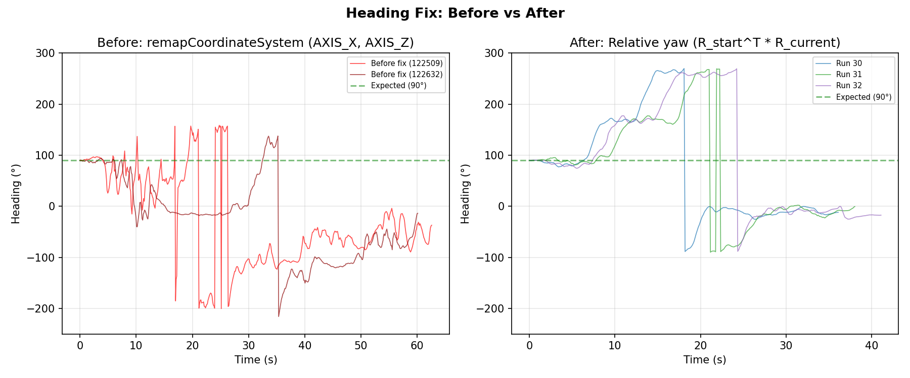
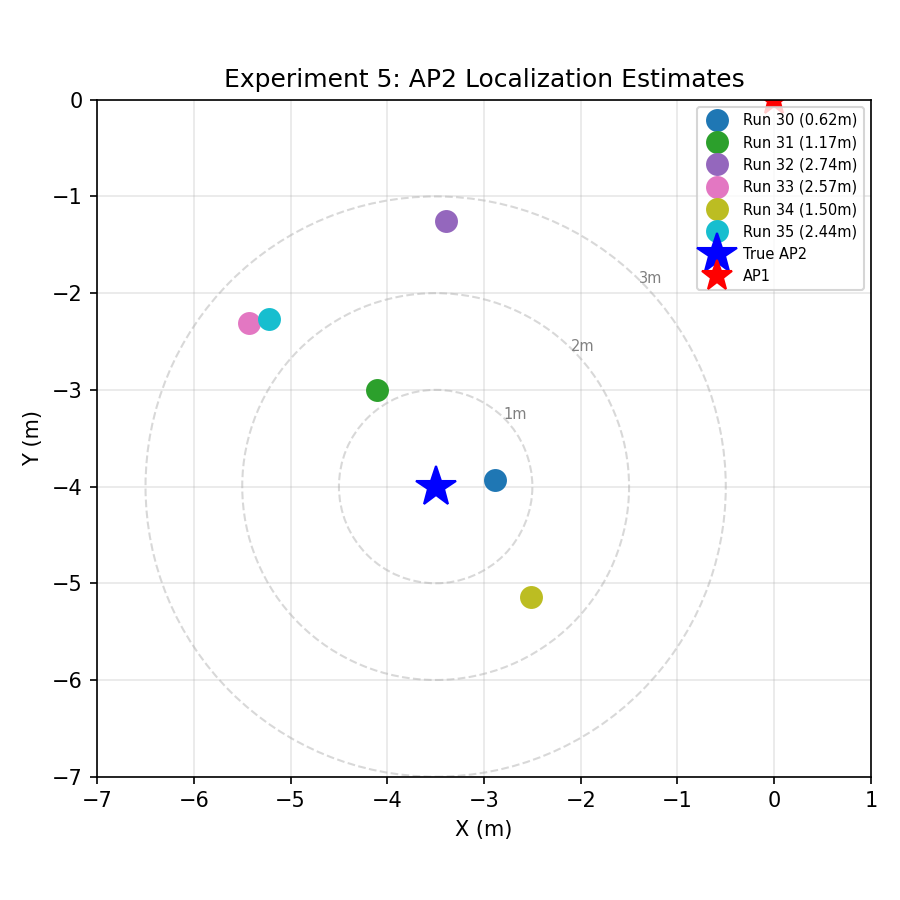

---

## Experiment 6: Extended testing — 5 trajectories × 3 AP positions (colleague runs)

### Setup
- Colleague-collected dataset, 15 runs total (`data/traj{1-5}_{anchor_x}_{anchor_y}.csv`)
- Same build as Experiment 5 (heading fix + tangential floor)
- **Waypoint grid**: 3×4 m area with integer-grid waypoints
- **Unknown AP positions tested**: (0, 4), (3.5, 0), (3.5, 4) — one known anchor + one unknown per run
- Five trajectory shapes, each repeated for all three AP positions

### Trajectory shapes

| Shape  | Waypoints | Description                                    |
|--------|:---------:|------------------------------------------------|
| **T1** | 13        | 3×4 perimeter (right → top → left sides)       |
| **T2** | 19        | 3×4 boustrophedon (snake) — full coverage      |
| **T3** | 7         | L-shape: x-axis then y-axis                    |
| **T4** | 4         | Straight line along y-axis                     |
| **T5** | 3         | Short corner (2-segment)                       |

### Results (by file)

| Run              | GT AP₂     | Est AP₂           | AP err | Pos err (mean / max) |
|------------------|:----------:|:-----------------:|:------:|:--------------------:|
| traj1_0_4        | (0.0, 4.0) | (0.24, 4.33)      | **0.41** | 0.95 / 1.63         |
| traj1_3_5_0      | (3.5, 0.0) | (1.59, -0.67)     | 2.03   | 0.84 / 2.02          |
| traj1_3_5_4      | (3.5, 4.0) | (2.34, 2.52)      | 1.88   | 0.77 / 1.75          |
| traj2_0_4        | (0.0, 4.0) | (-2.56, 3.04)     | 2.73   | 1.21 / 2.43          |
| traj2_3_5_0      | (3.5, 4.0) | (1.48, 3.23)      | 2.17   | 0.83 / 1.87          |
| traj2_3_5_4      | (3.5, 0.0) | (0.77, 0.01)      | 2.73   | 1.05 / 3.32          |
| traj3_0_4        | (0.0, 4.0) | (1.52, 3.85)      | 1.53   | 0.54 / 0.75          |
| traj3_3_5_0      | (3.5, 4.0) | (3.26, 2.00)      | 2.02   | 0.49 / 0.71          |
| traj3_3_5_4      | (3.5, 0.0) | (2.31, -0.51)     | 1.29   | 1.07 / 2.31          |
| traj4_0_4        | (0.0, 4.0) | — (no AP₂)        | —      | 0.68 / 0.83          |
| traj4_3_5_0      | (3.5, 0.0) | (11.56, 0.27)     | 8.06   | 0.49 / 0.71          |
| traj4_3_5_4      | (3.5, 4.0) | — (no AP₂)        | —      | 0.33 / 0.53          |
| traj5_0_4        | (0.0, 4.0) | — (no AP₂)        | —      | 0.67 / 0.75          |
| traj5_3_5_0      | (3.5, 0.0) | (2.57, 3.70)      | 3.81   | 0.68 / 0.79          |
| traj5_3_5_4      | (3.5, 4.0) | (4.05, 6.42)      | 2.48   | 0.70 / 0.82          |

Note: filenames `traj2_3_5_0` and `traj2_3_5_4` appear to have the anchor/unknown labels swapped in their filenames; the in-file `gt_ap_x/y` is authoritative and used above.

### Summary

| Metric                       | Value          |
|------------------------------|:--------------:|
| Runs total                   | 15             |
| AP₂ localization succeeded   | 12/15 (80%)    |
| Position error (mean of run means) | **0.75 m** |
| Position error (range)       | 0.33 – 1.21 m  |
| AP₂ error — mean             | 2.59 m         |
| AP₂ error — median           | 2.17 m         |
| AP₂ error — best             | **0.41 m**     |
| AP₂ error — worst            | 8.06 m         |
| AP₂ <2 m                     | 4/12 (33%)     |

### Key observations (Experiment 6)
1. **Position tracking is solid across all shapes**: mean waypoint error 0.33-1.21 m for every run — the heading-fix + tangential-floor tuning from Exp 5 generalises to new trajectories and new AP geometries.
2. **AP₂ accuracy scales with trajectory coverage**:
   - T1 (perimeter, 13 WP) and T2 (boustrophedon, 19 WP) consistently produce finite AP₂ estimates with errors 0.4-2.7 m.
   - T3 (L-shape, 7 WP) works but errors cluster near 1.3-2.0 m.
   - T4 (straight line) and T5 (short corner) frequently fail: 3/6 runs produced **no AP₂ estimate** and one (traj4_3_5_0) produced a wildly wrong estimate (8.06 m, est_x=11.56). These short/low-diversity trajectories lack the geometric spread required for reliable multilateration.
3. **Best result**: traj1 with AP at (0, 4) — 0.41 m error. This matches Exp 4's best (0.48 m) in a different room/AP configuration, confirming the pipeline can reach sub-metre AP₂ localisation when the trajectory has enough geometric diversity.
4. **Anchor-AP asymmetry**: runs where the unknown AP is at (3.5, 0) or (3.5, 4) — i.e. on the short edge of the walking grid — tend to have higher AP₂ error than runs where it is at (0, 4). The 3.5 m AP positions are at the edge of or outside the trajectory convex hull, weakening the trilateration geometry.
5. **Recommendation**: for demo runs, walk T1 or T2 (perimeter or snake). Avoid short straight-line trajectories.

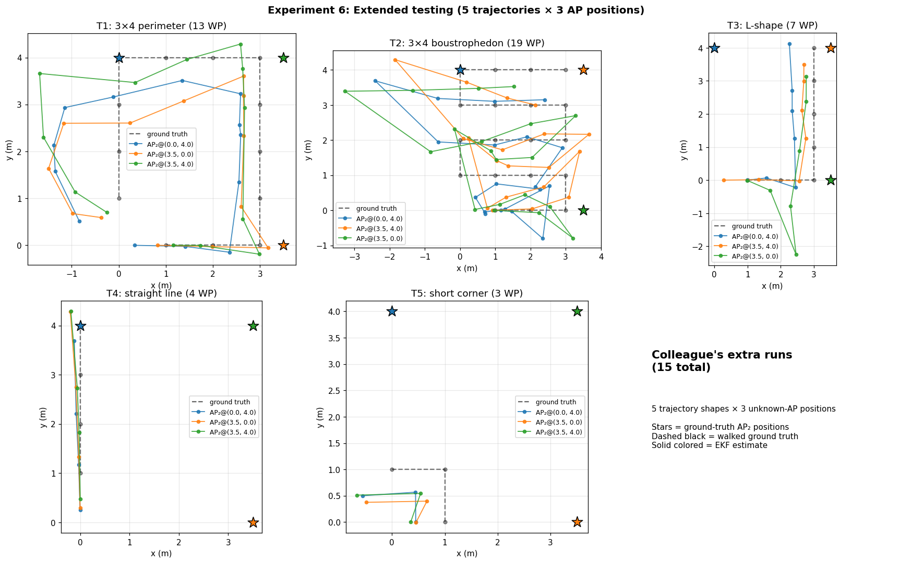
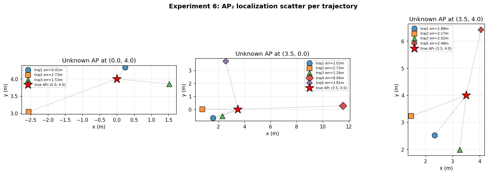
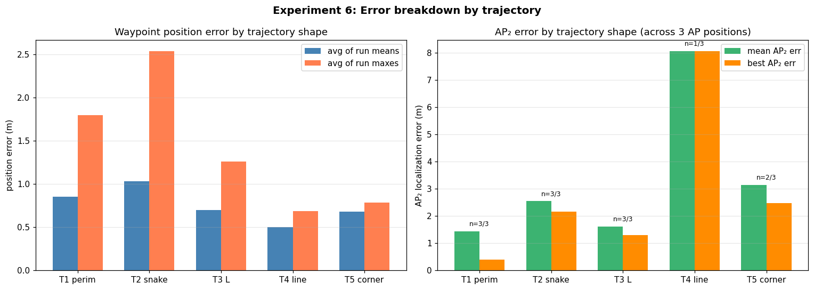

### Per-trajectory AP₂ position plots (GT vs estimate)

Each plot shows the walked ground truth (dashed), the three ground-truth AP₂ positions (stars) and the corresponding EKF estimates (X markers, colour-matched). A thin line links each GT AP to its estimate.

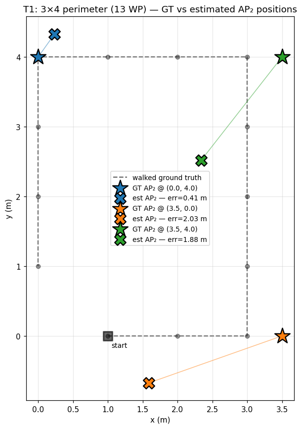
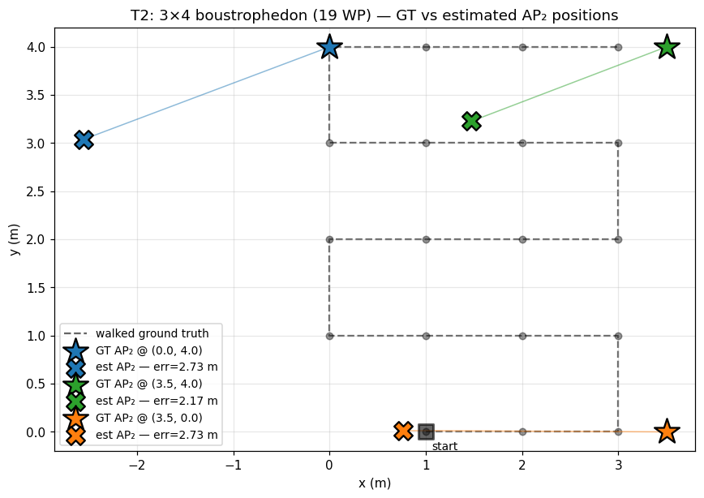
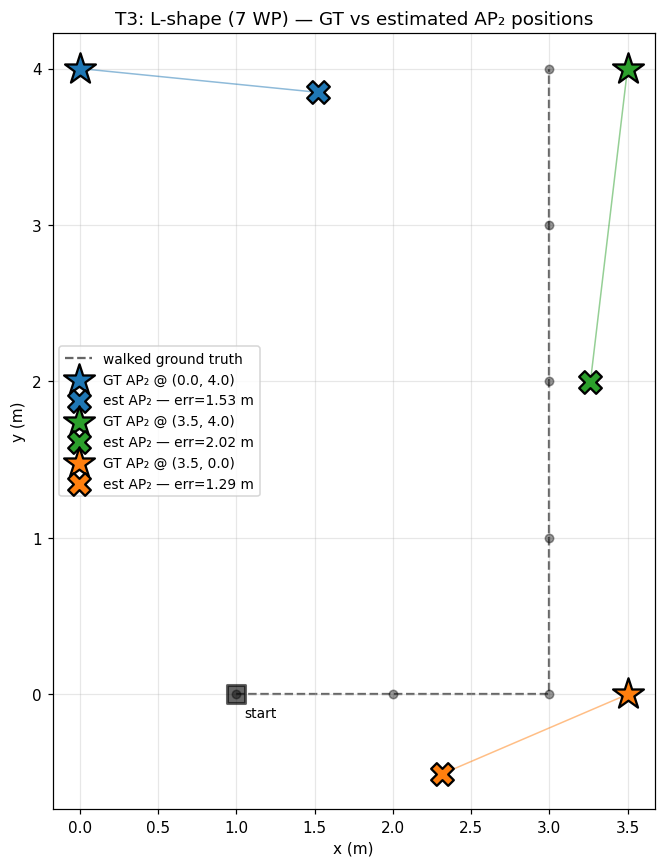
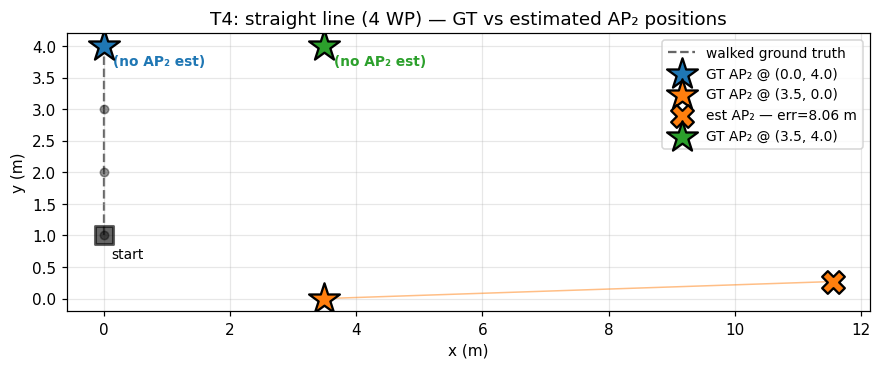
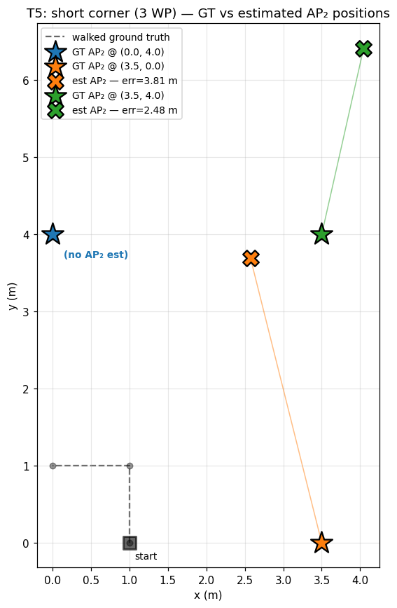

---

## Report figures (publication-quality)

A condensed set of figures intended for the Advanced Wireless Networks course report.
Consistent style (serif font, colour-blind-safe palette, no gratuitous borders/grids).
Generated from the same Experiment 6 dataset; the less-polished exploratory figures
above are retained for reference.

| Figure | Purpose |
|--------|---------|
| `fig_position_cdf.png` | CDF of waypoint position error — a standard plot for positioning papers. Reports the headline number (median ≈ 0.73 m, 90th percentile ≈ 1.60 m across 138 waypoints). |
| `fig_ap2_scatter.png` | All 12 successful AP₂ estimates plotted against the three GT AP positions, with markers distinguishing trajectory shape. Shows the spread of the localisation output. |
| `fig_ap2_by_trajectory.png` | AP₂ error as a strip plot by trajectory shape; mean overlaid as a horizontal bar. Makes the "richer trajectory ⇒ lower error" point visually. |
| `fig_ap2_vs_length.png` | AP₂ error vs trajectory length (waypoint count); failures (no AP₂ estimate) shown as red crosses at the x-axis. |
| `fig_best_trajectories.png` | Two-panel showcase of the two reliable trajectory shapes (T1, T2) with all three AP positions on each. |
| `fig_best_run_detail.png` | Best single run (T1 + AP₂ @ (0,4), 0.41 m error): trajectory on the left, per-waypoint error bars on the right. |
| `fig_ap2_distribution.png` | Two-panel: box + strip plot comparing Exp 5 (repeatability, same config n=6) and Exp 6 (generalisation across AP positions n=12), plus empirical CDF of AP₂ error. |
| `fig_ap2_best_mean.png` | Best / median / mean AP₂ error for Exp 5 and Exp 6 — the headline summary figure. |
| `fig_exp5_trajectories.png` | All 6 repeated square-walk trials of Exp 5 overlaid on one axis (AP₂ ground truth at (-3.5, -4)). Visualises the trial-to-trial variability that the σ = 0.87 m number quantifies. Style differs from the other report figures (default matplotlib colours and legend placement) because the raw CSVs were no longer available on disk and the figure was retained from the original generation. |

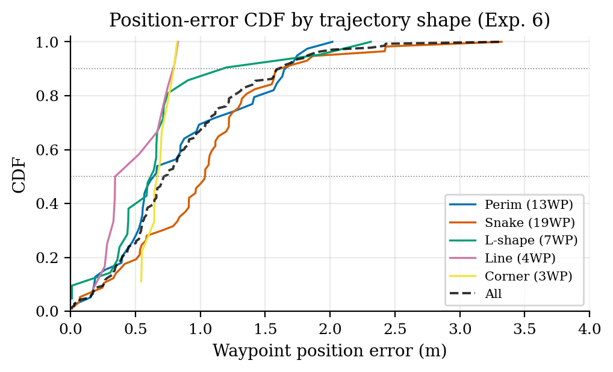
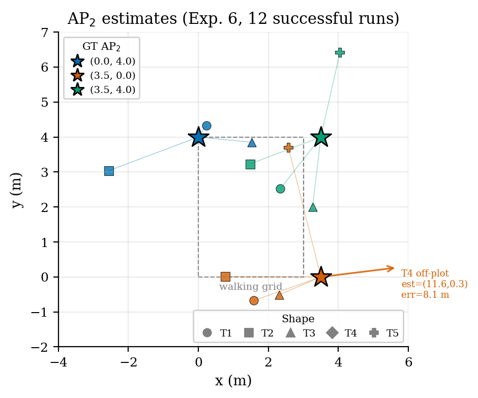
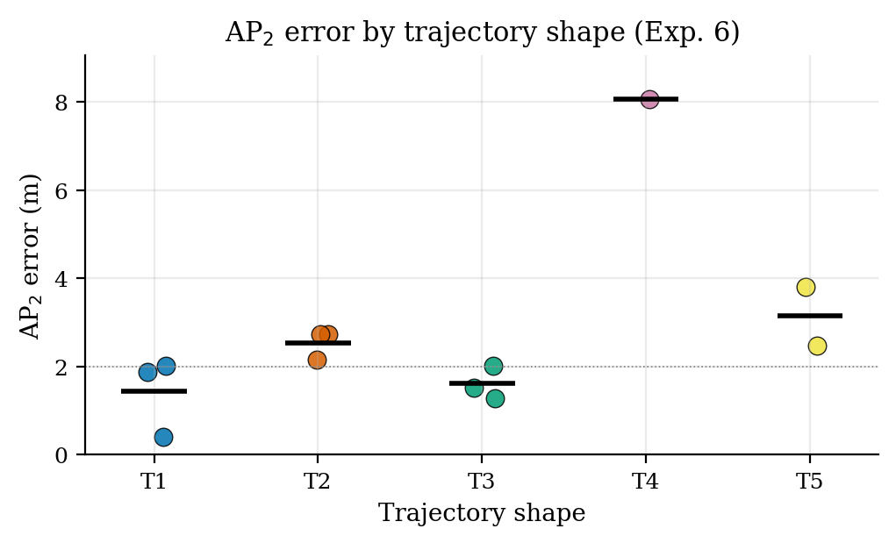
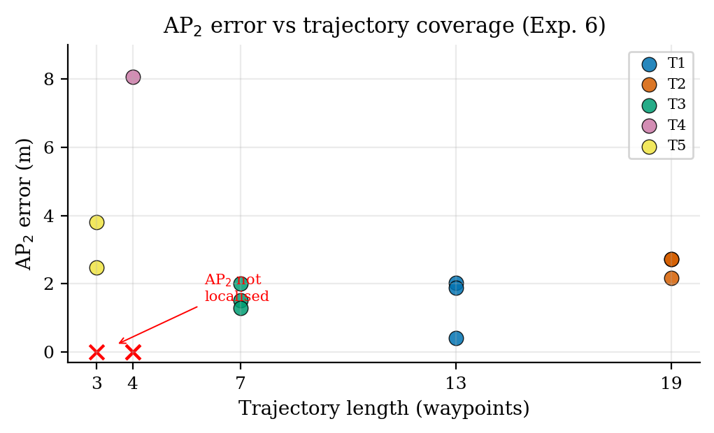
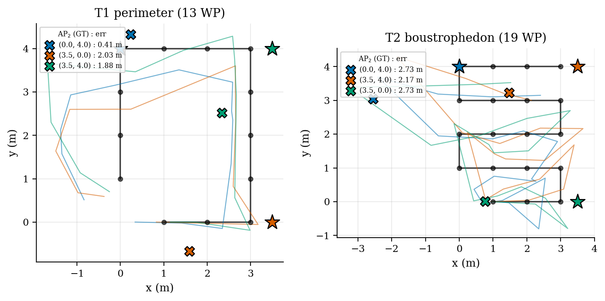
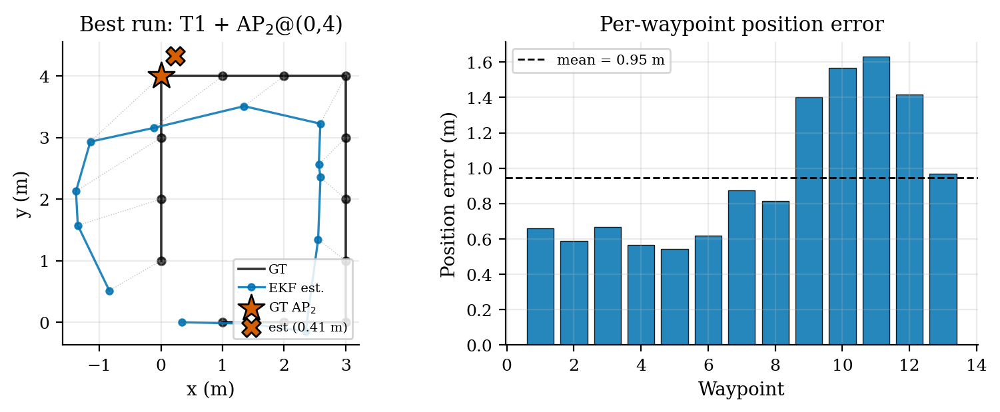
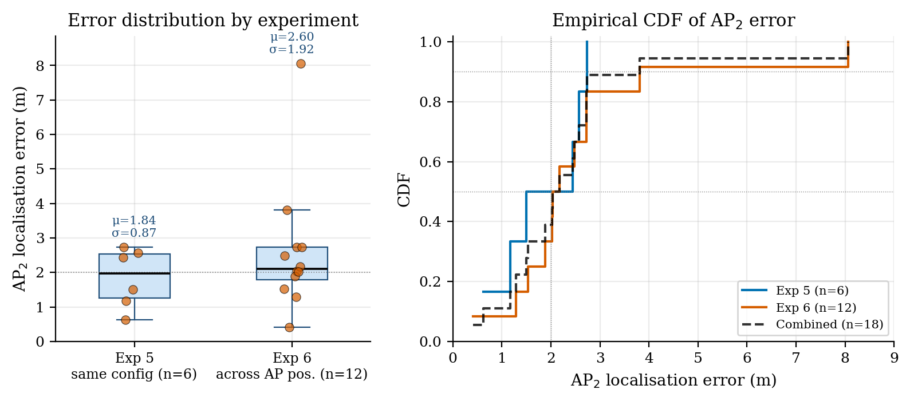
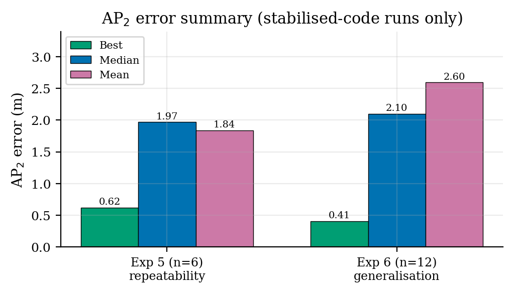
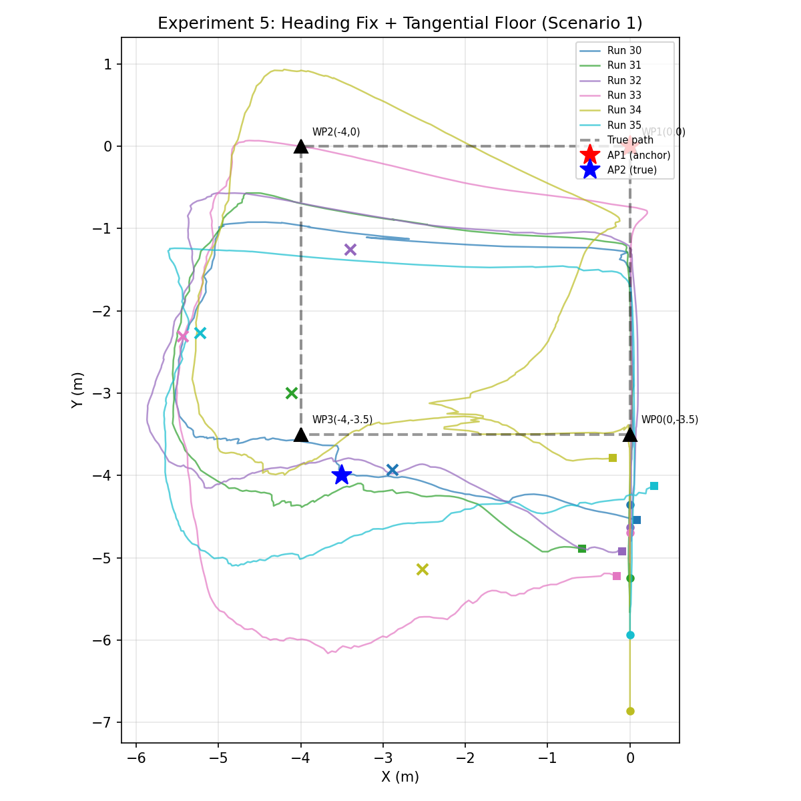

### Evaluation summary — stabilised-code experiments only

Experiments 1–4 are development/tuning runs in which the code changed between runs
(PREDICT_STEP adjustments, adaptive step, height correction, distance-dependent R,
heading remap). They are retained above for historical record but **excluded from
the evaluation below**, because pooling them conflates algorithm versions. The
evaluation rests on Experiments 5 and 6, both using the final build
(relative-rotation heading + tangential floor + distance-dependent R).

| Experiment   | Role                              | n  | Best   | Median | Mean ± σ   |
|--------------|-----------------------------------|:--:|:------:|:------:|:----------:|
| **5** — same config, repeated     | Repeatability (1 AP position)     | 6  | 0.62 m | 1.97 m | 1.84 ± 0.87 m |
| **6** — 5 trajectories × 3 APs    | Generalisation across geometry    | 12 | **0.41** m | 2.10 m | 2.60 ± 1.92 m |
| **Combined (5 + 6)**              | Stabilised-code evaluation set    | 18 | **0.41** m | **2.10** m | 2.34 ± 1.65 m |

### Headline numbers for the report

- **Waypoint position error (Exp. 6, N = 138 waypoints)**: median **0.73 m**, 90th pct **1.60 m**, 95th pct **1.83 m**.
- **AP₂ localisation (stabilised code, N = 18 runs)**: best **0.41 m**, median **2.10 m**, mean **2.34 m**, 7/18 (39 %) under 2 m.
- **Repeatability (Exp. 5, n = 6 identical trials)**: σ = **0.87 m** around a mean of 1.84 m — quantifies the trial-to-trial variability at one AP configuration.
- **Generalisation (Exp. 6, n = 12 across 3 AP positions × 5 trajectories)**: σ = **1.92 m** — larger spread is driven by short trajectories (T4/T5) and weak geometry when AP₂ is outside the trajectory convex hull.
- **Heading reversal rate**: **0/18 runs** with the stabilised code.

## Recommended further experiments (if time allows)

The current dataset is sufficient to demonstrate the pipeline works, but several
gaps make it difficult to write quantitative claims that would survive review
in a graduate-level wireless networks report.

1. **Repeatability / variance.** Each of the 15 runs is a single trial. Without
   ≥5 repetitions per (trajectory × AP) cell, the per-cell numbers carry no
   confidence interval. Priority: repeat T1 and T2 with AP₂ at each of the
   three positions, five times each (30 runs total). This is what lets us
   put error bars on every number above.
2. **Component-ablation.** The current design layers four improvements
   (calibration period, height correction, heading fix, tangential floor,
   distance-dependent R). A principled report needs to show each component's
   individual contribution by running with that component disabled. Four
   ablation runs on one trajectory are enough to populate a small table.
3. **Baseline comparison.** We have no comparison against a published or
   naïve baseline (raw FTM + dead-reckoning, FTM-only trilateration with
   random walk, etc.). Reviewers will ask for one. At minimum: compute the
   AP₂ error that would have been obtained by pure FTM trilateration using
   the recorded FTM samples, using the GT phone positions instead of our
   EKF estimates. That upper-bound-for-FTM-only number contextualises our
   result.
4. **Effect of trajectory speed / duration.** T4–T5 fail not just because
   they are short but because they contain almost no geometric diversity.
   Confounding those factors would let us separate "trajectory is too short
   in time" from "trajectory lacks 2D coverage". A controlled experiment:
   same T1 shape walked slowly (60 s) vs quickly (20 s).
5. **FTM noise model validation.** The distance-dependent R = 0.5 + 0.25 r
   was measured empirically in CalibrationActivity but never validated in
   the Exp 5–6 runs. Plotting the per-sample FTM residual (|measurement − true
   range|) against true range across all 15 runs would confirm or refute the
   linear-in-range noise model.
6. **NLoS / obstruction sensitivity.** All runs are LoS. One deliberately
   occluded run (person standing between phone and anchor for 10 s) would
   demonstrate graceful degradation — or expose a failure mode we need to
   discuss.
7. **Device heterogeneity.** Single device (Mi Note 10 Lite). Publishable
   claims about accuracy ideally include ≥1 other phone to show the
   pipeline is not overfit to one IMU/FTM stack. Low priority if time-limited.
8. **Calibration robustness.** We calibrate FTM once, against one AP, at
   one distance range. Re-running with calibration taken at 1 m and applied
   at 5 m (and vice versa) would demonstrate whether the slope/intercept
   generalises.

If forced to pick three, I'd do **(1) repeatability on T1/T2**, **(2) component
ablation**, and **(3) FTM-only baseline** — those three alone give enough
material to turn the current results section into a proper "Evaluation" chapter.
